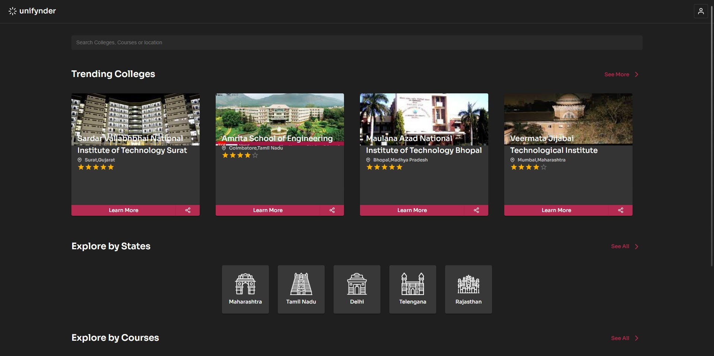

<!-- PROJECT LOGO -->
 

  

  <h3 align="center">Unifynder</h3>
  

    Unifynder is a web application that is a one-stop for everyone needing information on colleges and universities throughout India. Through our web app, students can sign up, enter their personal information and examination details (marks scored, rank, etc.), and find out all colleges they are eligible to apply to
     
     
    <a href="https://youtu.be/_QptJD0PCuY">View Demo Video</a>
  

<!-- ABOUT THE PROJECT -->
## About The Project

We hate going through the same tedious work again and again, hence, we cleared this issue by implementing our own Locker, which serves as a secure place to store ones mark-sheets and other important documents which are essential for admission. So regardless of where you are, you can access them from our app which stores it in a secure folder over the cloud.

### Built With

* [React.js](https://reactjs.org/)
* [Node.js](https://nodejs.org/)
* [MUI](https://mui.com/)

<!-- ROADMAP -->
## Roadmap

- [ ] Feature 1
- [ ] Feature 2
- [ ] Feature 3
    - [ ] Nested Feature
