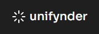

<!-- PROJECT LOGO -->
 

  

  <h3 align="center">Unifynder</h3>
  

    Unifynder is a web application that is a one-stop for everyone needing information on colleges and universities throughout India. Through our web app, students can sign up, enter their personal information and examination details (marks scored, rank, etc.), and find out all colleges they are eligible to apply to
     
     
    <a href="https://youtu.be/_QptJD0PCuY">View Demo Video</a>
  

<!-- ABOUT THE PROJECT -->
## About The Project

We hate going through the same tedious work again and again, hence, we cleared this issue by implementing our own Locker, which serves as a secure place to store ones mark-sheets and other important documents which are essential for admission. So regardless of where you are, you can access them from our app which stores it in a secure folder over the cloud.

### Built With

* [React.js](https://reactjs.org/)
* [Node.js](https://nodejs.org/)
* [MUI](https://mui.com/)

<!-- Features -->
## Features

- Search bar: To search about different courses,colleges, etc.
- Filter:  It provides a  multichannel filter pages which sort data on the basis of ranking,fees and cutoff.
- Sort: A user can get data on a range of topics, including colleges, ratings, stream, curriculum, placements, facility, costs, admissions, to make more effective career choices.
- Details info about college: A complete overview about the colleges like fees, faculties departments etc.
- Watchlist: Select colleges you are interested in and add them to your watchlist to receive news about your selected colleges.
- News Feed: All news about the recent activities  in the educational sector. 
- Am I eligible: Shows information about colleges which the student can get into based on the cut-offs.
- Locker: A secure place where one can store essential documents needed for securing admission like mark-sheets.
- Watchlist: Select colleges you are interested in and add them to your watchlist to receive news about your selected colleges.
- News Feed: All news about the recent activities  in the educational sector. 
- Am I eligible: Shows information about colleges which the student can get into based on the cut-offs.
- Locker: A secure place where one can store essential documents needed for securing admission like mark-sheets.
